# CLG Finger

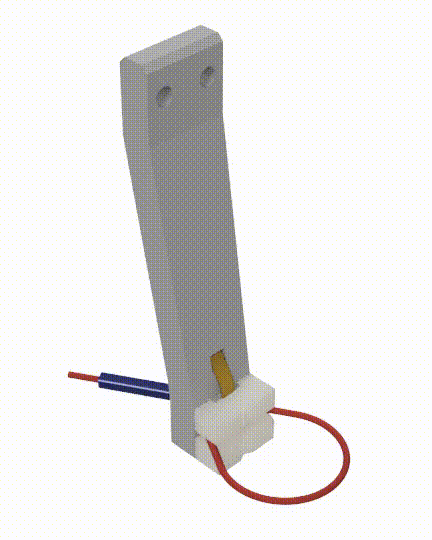

The CLG finger is the version of the CLG that can be installed on a Parallel jaw gripper.

## Bill of Materials

| item                        | qty |
|-----------------------------|-----|
| Grey Resin 1 L              | 1   |
| Elastic 50A Resin 1 L       | 1   |
| Singletact 10mm 10N         | 1   |
| Singletact Electronic       | 1   |
| PTFE 6/2 mm                 | x   |
| 1.75 TPU/ninjaflex filament | x   |
| M3x6mm grub screw           | 1   |
| M2x6mm button head screw    | 1   |

x - length depends on installation

## Manufacturing

We recommend 3D printing the components using a resin 3D printer, the main body in rigid resin, the fingertips in flexible resin.

## Assembly

### Singletact modification

Before starting assembling the finger we need to remove the female Dupont header from the Singletact electronic board. After this step is complete we can solder our harness on.

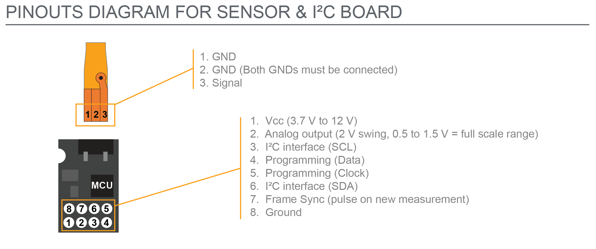

We will always need power connection and depending and the I2C line or analog pin depending on how we want to get reading from the sensor.

### Finger

Start by threading the Singletact sensor tail through the dedicated channel. Make sure that sensor is placed in the same orientation as the figure below, with the ridge of the circle facing outwarda.

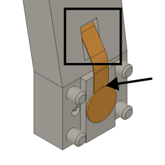

Next, connect the electronic board to the Singletact sensor, the bare face of the PCB shoul be facing outward. Scre the electronic board using the M2x6mm button head screw.

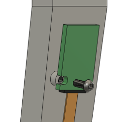

Next, push the bottom fingertip onto the bottom 2 pegs of the finger. The bottom figertip can be recognised by the fact that the face that will go against the finger is fully flat.

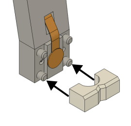

Next, slide the cable rest over the Singletact sensor into the slot in the bottom fingertip.

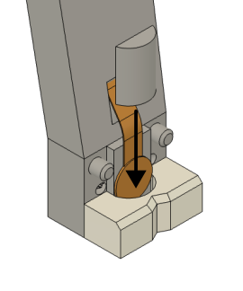

Next, push to the top fingertip over the 2 pegs.

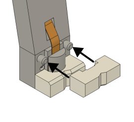

Next, push the PTFE bowden tube into the hole on the back of the finger.

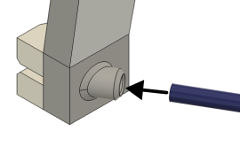

Next, feed the TPU cable through the bowden tube

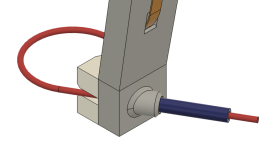

And form the loop by pushing the free end of the cable into re remaining channel, making sure to push until the cable reaches the end of the channel. The tip of the cable should be visible though the hole in the bottom of the finger.

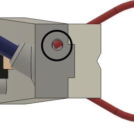

Finally, fix the cable by screwing the M3x6mm grub screw in the hole in the bottom of the finger.

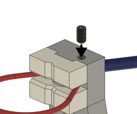

The CLG-finger assembly is now completed.