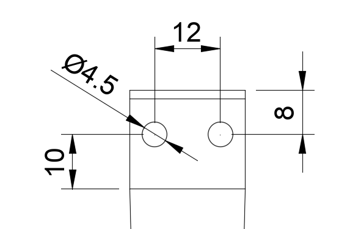

# loopo_manufacturing

This repository contains all the files and documentation required to manfacture a Cable Based Gripper (**CLG**/**LoopO**).

Each directory contains the digital manufacturing file as well as assembly instructions and bill of materials.

All fingers use the following mounting holes.

