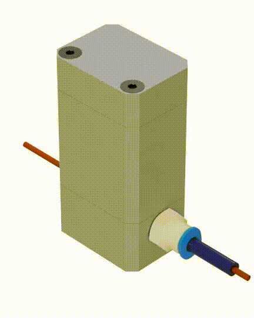
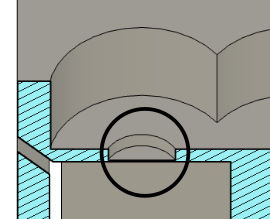
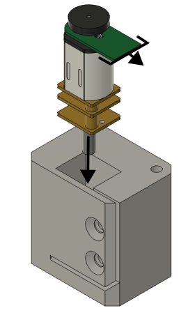
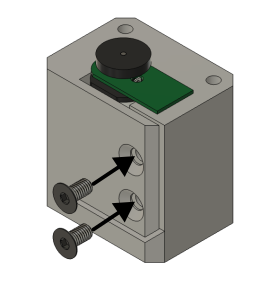
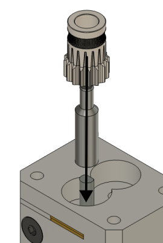
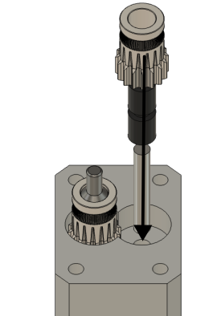
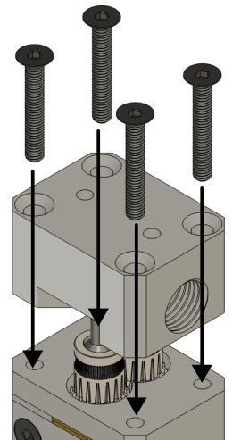
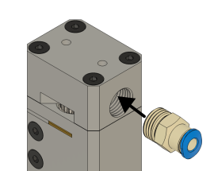
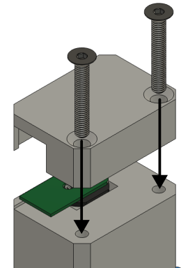

# Actuator

The actuator is used to push and pull on the cable of the CLG.

## Bill of Materials

| item                                                | qty |
|-----------------------------------------------------|-----|
| PLA plastic spool                                   | 1   |
| Micro Metal Gearmotor (Extended back shaft) – 298:1 | 1   |
| Micro Metal Motor Encoder – Sideways (Pimoroni)     | 1   |
| Bondtech 5mm extruder drivegear kit                 | 1   |
| M3x20mm countersunk screw                           | 6   |
| M3x6mm countersunk screw                            | 2   |
| M10 6mm push-fit pneumatic fitting                  | 1   |
| mini jst to mini jst cable                          | 1   |
| PTFE 6/2 mm                                         | x   |

## Manufacturing

All the components can be 3D printed using an FDM machine. The components should be 3D printed in the give orientation to avoid using support material. Before assembly the hole for the motor in the main body should be cleared of the support layer

And soldered the encoder board to the motor.

## Assembly

Insert the DC motor into the main body, insuring the protruding side of the encoder PCD is on the same side as the screw holes.

Next, use the 2 M3x6mm countersunk screws to clamp the motor into position. the screws will form their own thread in the holes.

Next, place the shaft adapter and the drive extruder gear (the one with the set screw) on the motor shaft, aligning the set screw with the shaft flat and tightening the set screw.

Next place the idler extruder gear (gear, pin and 2 bearings) assembly in position next to the drive gear.

Next, place the gear cover on top of the gears paying attention to having the side with the cutout aligned with the dive gear, and screw it down with 4 M3x20mm countersunk screws.

Next, screw the pneumatic fitting into the threaded hole on the gear cover.

Finally, install the encoder cover and screw it down using 2 M3x20mm countersunk screws.

The actuator is now fully assembled.