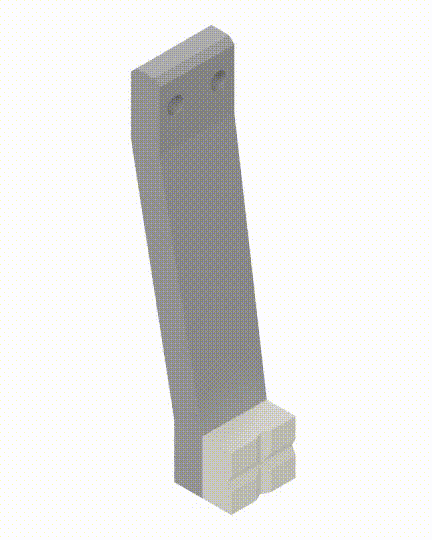
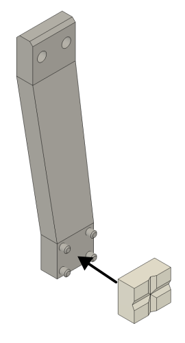

# Plain finger

  
The plain finger is a copy of the CLG finger, but without the CLG components. It is needed as a second finger for a parallel jaw gripper with a CLG finger installed.

## Bill of Materials

| item                  | qty |
|-----------------------|-----|
| Grey Resin 1 L        | 1   |
| Elastic 50A Resin 1 L | 1   |

## Manufacturing

We recommend 3D printing the components using a resin 3D printer, the main body in rigid resin, the fingertip in flexible resin.

## Assembly

The fingertip then can be push fit in position.

